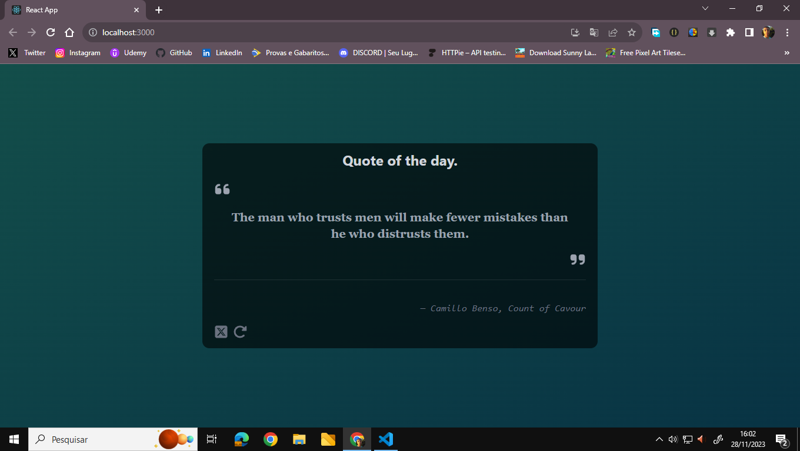

# Random Quote Generator



This project is a ReactJS application designed to load quotes by leveraging an external API.

💻[Link API](https://github.com/lukePeavey/quotable)

## Demonstration

You can view the live application by following this link.

🌎[Link Site]()

## Utilized Technologies

- ReactJS 
- TailwindCSS 
- JavaScript 

## How to use

1. Clone this repository

```bash
git clone https://github.com/seu-usuario/seu-repositorio.git
```
2. Install the dependencies 

```bash
cd seu-repositorio
npm install
```
3. Run the application

```bash
npm run start
```